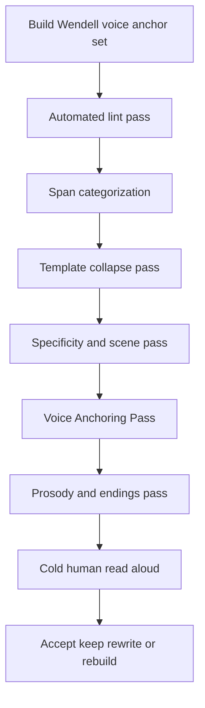

# Deep Research Report on Identifying and Removing AI Writing Fingerprints in Literary Nonfiction

## Executive summary

The research base is now strong enough to say that “AI-sounding prose” is not one single tell. It is a bundle of regularities that recur at several levels at once: word choice, sentence templates, paragraph architecture, discourse habit, and even narrative design. Across peer-reviewed studies, AI prose is repeatedly associated with lower stylistic variance, tighter clustering by model, more predictable lexical choice, repeated syntactic templates, more formal or neutral register, over-explanation, tidy conclusions, and a tendency to substitute generic motion for real informational or emotional movement. Those signals persist even when prompts ask models to sound more human, and they remain detectable to trained readers even after “humanization” attempts. citeturn13view3turn19view0turn13view0turn22view1turn18view2

The most useful discovery for your case is this: the problem has been “solved” operationally, but not in the sense of a single magic tool. The winning pattern is a pipeline. Automated methods are good at surfacing suspicious spans and repetitive structures; human editors are still better at restoring literary voice. The strongest academic workflow comes from Chakrabarty, Laban, and Wu’s LAMP work: expert writers converge on a seven-part taxonomy of AI idiosyncrasies, and an automated detection-plus-rewrite pipeline improves AI text significantly, but still loses clearly to expert human edits. Their result is encouraging for triage and first-pass cleanup, but it is also a warning: the last mile is voice, and voice is still human work. citeturn16view0turn17view2turn18view2

For Wendell, the practical implication is clear. Do **not** optimize for “passing” detectors. Optimize for eliminating the specific artifacts that offend your ear and replacing them with your own recurring moves: recognition, confession, game mechanics, reframing, and comic escalation. The right workflow is therefore: a custom style-lint layer to flag likely AI artifacts, followed by a human **Voice Anchoring Pass** that re-injects Wendell’s sentence logic, emotional asymmetry, and lived specificity. That workflow is the closest thing the field has to a solved method right now. citeturn17view5turn32view0turn32view4turn31search6

## What the research converges on

Several independent lines of research agree that AI writing differs from human literary prose less by isolated “bad words” than by distributions and habits. Stylometric work on creative writing shows that human texts form broader, more heterogeneous clusters, while LLM outputs cluster tightly by model, which means the underlying issue is often **homogeneity** rather than any single forbidden phrase. Comparative linguistic work finds that human texts show wider sentence-length scatter, more lexical variety, more distinct dependency and constituent use, and less uniform emotional framing. Interpretable cross-genre work at Carnegie Mellon likewise finds that key differentiators of machine text remain robust across generation conditions and that model choice affects style more than decoding strategy. citeturn13view3turn21view0turn19view0

At the sentence and span level, professional writers converge surprisingly well on what they dislike in model prose. In the LAMP study, the most common edit categories were awkward word choice and phrasing at 28%, poor sentence structure at 20%, unnecessary or redundant exposition at 18%, and clichés at 17%. The full seven-category taxonomy is: cliché, unnecessary exposition, purple prose, poor sentence structure, lack of specificity and detail, awkward word choice and phrasing, and tense inconsistency. That taxonomy is the single best research-backed editorial checklist for repairing AI prose without flattening it into generic “clean” prose. citeturn15view2turn16view0

Human expert detection studies add an important refinement: experienced readers do not rely only on vocabulary. Russell, Karpinska, and Iyyer found that frequent LLM users can detect AI-generated nonfiction articles extremely accurately, and their explanations spread across lexical clues, sentence structure, grammar and punctuation, originality, clarity, formatting, conclusions, formality, and tone. Vocabulary is the single most common clue family, but structural and discourse cues matter nearly as much. In other words, if you only scrub em dashes and “delve,” the prose may still sound like AI because the architecture is still AI. citeturn6search2turn22view1turn22view5turn23view3

The most sobering evidence is that naive “humanization” is not enough. Russell and colleagues constructed a detector-evasion “guidebook” from expert explanations and used it to prompt a humanizer. That reduced the effectiveness of many automatic detectors, but it still did not fool expert human readers in aggregate. Separately, practical detector evaluations show that many detectors fail badly in unseen settings and under moderate paraphrasing, sometimes collapsing to very low true-positive rates at strict false-positive thresholds. The lesson is not “detection is useless”; it is “binary detector scores are the wrong target for book editing.” Use detectors and heuristics to **flag** likely fingerprint zones, then repair for voice. citeturn13view2turn37search0

## Artifact atlas for literary nonfiction

The table below distills the artifact families most relevant to literary nonfiction, with the best evidence I found and a Wendell-specific replacement strategy.

| Artifact family | What it looks like on the page | Best evidence | Why readers hear “AI” | Best Wendell replacement |
|---|---|---|---|---|
| Lexical AI vocabulary | Overused words such as *delve, crucial, vibrant, robust, seamless, transformative, tapestry, landscape, testament, nuance*; boilerplate phrases like *it’s not about X, it’s about Y* or *it’s worth noting that* | Expert annotators’ “AI vocabulary” guide and clue taxonomy; Pangram’s pattern guide; open-source skills built from both citeturn23view2turn36view0turn35view0turn33view1 | The words are not wrong individually; the issue is density and recurrence, which creates an instantly familiar register | Replace abstraction with named actor, event, bodily sensation, or concrete consequence; when a contrastive reframe appears, turn it into confession or scene |
| Syntactic templates | Repeated POS-sequence shapes and stock sentence molds; “it’s not X, it’s Y”; “not only X but also Y”; “when it comes to…” | Syntactic template mining shows repeated abstract patterns in generated text; Stockton’s negation audit names the contrastive reframe as a common AI habit citeturn13view0turn32view2 | Readers feel déjà vu even if they cannot name the grammar | Break the template by stating the claim directly, or recast it as a lived misrecognition, reversal, or joke |
| Metronomic rhythm | Similar sentence lengths, similarly shaped paragraphs, predictable clause balance, overuse of em dash or triads | Comparative linguistics and humanizer tools emphasize low burstiness and low sentence-length variation in AI prose; GPTZero itself treats burstiness as a key signal citeturn21view0turn35view0turn38search2 | The prose feels paced by a metronome instead of a mind | Introduce asymmetry: one spare sentence, one winding sentence, one pivot sentence; let rhythm follow thought rather than content plan |
| Over-explanation | Paragraphs that restate the point in nicer words; “showing/telling twice”; thematic panning-out at the end of sections | LAMP taxonomy: unnecessary exposition is a major edit class; “slop” work shows density and relevance are major predictors of low-quality AI text; nonfiction editors report uniform sections ending in thesis-pan lines citeturn15view2turn27view0turn29view4 | The prose moves, but does not advance; it feels frictionless and deadened | Make every paragraph earn its place by adding one new turn: a revealing example, an admission, a test, a counterexample, or a comic overreach |
| Tidy discourse architecture | Optimistic conclusions, balanced headers, uniform formatting, all-purpose wrap-ups | Expert clue studies flag formatting regularity, long neat conclusions, and over-tidy endings as AI tells citeturn23view3turn22view5 | Books do not usually end every subsection like a blog post or LinkedIn lesson | End later; cut the moral; stop on an image, implication, or unresolved turn |
| Lack of specificity | Generic nouns and “importance” language where a real person, object, scene, or rule should be | LAMP includes lack of specificity and detail as a core category; human writing in comparative studies shows more diversity and optimized structure citeturn16view0turn21view0 | The reader cannot feel what was at stake for someone in particular | Use recognition and confession: who did what, when, at what cost, and what you noticed too late |
| Neutralized tone | Cheerful, inoffensive, evenly weighted treatment of everything; emotional flattening | Expert clue taxonomy includes tone and formality; comparative studies show LLM text skews more neutral or positive than human news writing citeturn22view2turn21view0 | Literary nonfiction lives on partiality, emphasis, and controlled bias | Let the narrator prefer, dislike, wince, overreact, or revise himself |
| Tidy single-track argument/narrative | One-track development, over-explained themes, low ambiguity | StoryScope finds AI fiction over-explains themes and favors tidy single-track plots while human fiction shows more ambiguity and temporal complexity citeturn5search2 | The prose feels resolved before it has earned resolution | Introduce reframing and game mechanics: what rule changed, where did the frame crack, what competing interpretation survived |

The two most important findings for your specific ear are narrower than the whole table. First, your “not X but Y” concern is not idiosyncratic; it now appears in practitioner audits, expert detection guides, and open-source anti-AI rule sets. Second, what annoys you as “blog style” is usually a compound artifact: contrastive reframe + triad + neat thematic closer + uniform paragraphing. Any edit pass that handles only one of those will leave the film in place. citeturn32view2turn23view2turn33view1turn29view4

### Observed recurrence in the strongest evidence base

| Signal family | Frequency or recurrence evidence | Source |
|---|---:|---|
| Awkward word choice / phrasing edits | 28% of LAMP edits | citeturn15view2 |
| Poor sentence structure edits | 20% of LAMP edits | citeturn15view2 |
| Unnecessary exposition edits | 18% of LAMP edits | citeturn15view2 |
| Cliché edits | 17% of LAMP edits | citeturn15view2 |
| Vocabulary clues in expert explanations | 53.1% overall | citeturn22view1 |
| Sentence-structure clues | 35.9% overall | citeturn22view1 |
| Grammar / punctuation clues | 24.8% overall | citeturn22view1 |
| Originality clues | 23.7% overall | citeturn22view6 |
| Clarity clues | 19.5% overall | citeturn22view5 |
| Formatting clues | 15.0% overall | citeturn23view3 |
| Conclusion clues | 13.1% overall | citeturn23view3 |
| Formality clues | 12.3% overall | citeturn23view3 |
| Tone clues | 9.3% overall | citeturn22view2 |

## Detection methods and tools

No single detector is sufficient for literary nonfiction. The methods below are most useful when treated as **flagging systems**, not judges.

| Method or tool | Artifact targeted | Detection approach | Repair workflow | Required skill level | Sample before/after | Source |
|---|---|---|---|---|---|---|
| Human expert rubric | Lexicon, structure, clarity, originality, formatting, tone | Trained readers annotate explanations, not just labels | Flag span → explain why it sounds AI → rewrite by intent, not synonym swap | High | **Before:** “In conclusion, this underscores the importance of community.” **After:** “The room went quiet when he said it. That was the moment I stopped pretending the problem was only mine.” | citeturn6search2turn22view1turn22view5 |
| LAMP span detector + category-specific rewrite pipeline | Cliché, exposition, purple prose, sentence structure, specificity, phrasing, tense | Few-shot span extraction with category labels, then category-specific rewrite prompts | Detect spans → rewrite only those spans → reinsert → human review | Medium to high | **Before:** “Her irritation slowly morphed into a strange, disconnected calm.” **After:** add context that makes the calm legible rather than abstract | citeturn17view1turn17view2turn17view5turn18view2 |
| Syntactic template mining | Repeated sentence molds and POS patterns | Extract recurring POS-sequence templates across a corpus | Use template flags to decide where to rewrite from scratch rather than patch | High | **Before:** repeated “It’s not X, it’s Y” across sections. **After:** direct assertions in mixed forms | citeturn13view0 |
| StoryScope | Tidy discourse design, thematic over-explanation, flat escalation | Narrative-feature extraction across 304 discourse-level features | Use on long-form chapters to spot over-explained or single-track sections, then rewrite structure | High | **Before:** thesis explained, then re-explained, then concluded. **After:** scene → implication → reframing | citeturn5search2 |
| Pangram | Style, word choice, syntax, grammatical structure | Proprietary deep-learning detector over content only; company explicitly rejects pure perplexity/burstiness | Use score and highlights to surface suspicious regions, not as acceptance criterion | Low to medium | **Before:** clustered AI vocabulary and neat headers. **After:** remove pattern cluster, vary structure, verify with human read | citeturn36view2turn36view1 |
| GPTZero | Predictability, burstiness, generic style, paraphrase cues | Proprietary model using hundreds of factors; company documentation still foregrounds perplexity and burstiness | Use advanced sentence scan to find suspicious passages, then rewrite for specificity and rhythm | Low | **Before:** evenly paced generic paragraph. **After:** add asymmetry, details, and stance | citeturn38search7turn38search17turn38search2 |
| DetectGPT / Binoculars family | Low-probability curvature / perplexity-family signals | Probability-based zero-shot detection | Useful only as weak corroboration; do not optimize prose toward these metrics | High | **Before:** “clean” AI paragraph may evade after paraphrase. **After:** real repair should not merely perturb probability statistics | citeturn20search9turn37search0turn36view1 |
| Vale with custom rules | Surface lexical and formatting patterns you already know you hate | Offline rule-based prose linting with custom regex and style rules | Encode Wendell-specific bans and warnings; run on every chapter before human pass | Medium | **Before:** `it’s worth noting that` flagged. **After:** deleted or replaced with direct claim | citeturn32view4 |
| proselint | Cliché, filler, weak style habits | Rule-based prose linting | Use as general prose hygiene layer beneath custom AI-fingerprint rules | Low to medium | **Before:** hedgy filler and cliché. **After:** tighter direct prose | citeturn32view5 |
| avoid-ai-writing | Word clusters, sentence templates, endings, hedges, generic closers, paragraph redundancy | Open-source rule set with tiered vocabulary, pattern categories, and rewrite guidance | Run in detect-only mode first; if 3+ pattern categories trigger, rewrite paragraph from scratch | Medium | **Before:** “This isn’t just a tactic—it’s a roadmap.” **After:** “The tactic worked once. The question is why I needed it in the first place.” | citeturn32view0turn33view1turn33view5 |
| humanizer | 28 named pattern detectors plus statistical signals | CLI / skill combining vocabulary tiers with burstiness, TTR, and repetition checks | Use for triage and reporting; keep auto-fix off for literary sections | Medium | **Before:** promotional, press-release rhythm. **After:** concrete, opinionated rewrite | citeturn35view0 |

The best evidence on effectiveness cuts in two directions. On the optimistic side, automated editing can materially improve AI drafts. In the LAMP evaluation, writers preferred expert-edited text most, but both oracle-span and fully automatic LLM-edited versions ranked well above raw LLM-generated paragraphs, with average rank 1.99 versus 2.47–2.55 for unedited AI text. On the cautionary side, that same study found expert-edited prose still won clearly, being ranked first 65% of the time. So repair is possible; replacement of the editor is not. citeturn18view2

A second caution is about detector reliability. Tufts, Zhao, and Li find that popular detectors struggle in unseen domains and under moderate adversarial prompting, with TPR@1% FPR dropping to 0% in some settings. Pangram and the Chicago Booth/NBER working-paper benchmark point in a more optimistic direction for commercial detectors, especially Pangram on medium and long passages, but even there the right use is triage rather than verdict. For your use case, expert explanation-style review remains more trustworthy than any scalar score. citeturn37search0turn37search11turn6search2

## Repair techniques and tools that actually help

The next table focuses on techniques and tools that are most worth applying or hiring around for this manuscript.

| Name | Author or organization | Year | URL | Method summary | Evidence of effectiveness | Limitations | Best adaptation to Wendell |
|---|---|---:|---|---|---|---|---|
| LAMP edit taxonomy and rewrite pipeline | Tuhin Chakrabarty, Philippe Laban, Chien-Sheng Wu | 2024 | `https://arxiv.org/abs/2409.14509` | Seven-category taxonomy of AI idiosyncrasies; span detection plus category-specific rewrite prompts | Automated edits significantly beat raw AI drafts; expert edits still win decisively citeturn18view2turn17view2 | Built on creative-domain paragraphs, not book-length literary nonfiction; rewriting still below expert quality | Use the seven categories as chapter-by-chapter markup labels, then rewrite only inside those labels |
| Writing Quality Reward Model | Chakrabarty, Laban, Wu | 2025 | `https://arxiv.org/abs/2504.07532` | Reward model trained on writing-preference datasets; ranks candidate revisions by writing quality | 74% accuracy on WQ benchmark; expert writers preferred WQRM-selected samples 66% overall, 72.2% when reward gap exceeded 1 point citeturn28search0 | Quality is not the same as Wendell’s voice; may reward polished generic prose if used naively | Use only to rank *Wendell-authored* rewrites, never as a generator of final prose |
| avoid-ai-writing | Conor Bronsdon | 2026 | `https://github.com/conorbronsdon/avoid-ai-writing` | Transparent open-source skill for detecting AI-isms with tiered vocabulary, sentence-template rules, and severity levels | Strong practical coverage; widely adopted GitHub project; explicit rule for when to rewrite from scratch rather than patch citeturn32view1turn33view5 | Not peer-reviewed; tuned for broad prose, not literary nonfiction | Convert the rule base into a Wendell-specific lint pack, especially for negation, generic closers, and hollow triads |
| humanizer | Brandon Wise | 2026 | `https://github.com/brandonwise/humanizer` | 28 pattern detectors + 560+ vocabulary terms + statistical checks like burstiness, TTR, repetition | Transparent detector categories and CLI workflow; good practical analyzer for reports and triage citeturn35view0 | Statistical thresholds are heuristic, not field-standard; auto-fix can over-normalize | Use report mode only; apply suggestions manually in chapters where rhythm matters |
| Vale | Vale / Joseph Kato | ongoing | `https://vale.sh/` | Offline prose linter with custom rules and style-guide enforcement | Mature, offline, customizable, already used widely for editorial consistency citeturn32view4 | Not AI-specific out of the box | Best foundation for a permanent Wendell style checker because it is private and rule-based |
| proselint | Amperser | 2016–ongoing | `https://github.com/amperser/proselint` | General prose linting based on editorial best practices | Useful for cliché, weak phrasing, and filler hygiene citeturn32view5 | Not trained on AI artifacts specifically | Use underneath your custom AI-fingerprint rules to keep cleanup from turning into sloppier human prose |
| editGPT | editGPT | 2024–2026 | `https://editgpt.app/` | AI editing with track changes and custom prompts intended to preserve voice | Official product emphasizes preserving voice and Word track changes citeturn12search4turn12search11turn12search17 | I did not locate independent literary-nonfiction validation; voice-preservation claims are vendor claims | Useful as a markup environment if you already know exactly what to ask it to flag and what not to touch |
| AI for Editors workflow training | Erin Servais / AI for Editors | 2023–2026 | `https://www.aiforeditors.com/` | Trains editors on few-shot prompting, rubrics, and custom assistants for repeatable editorial tasks | Public curriculum explicitly teaches few-shot tone matching, rubrics, and reusable assistants citeturn31search1turn31search5turn31search6turn31search10 | Training, not a plug-and-play detector; effectiveness depends on editor competence | Probably the best off-the-shelf path if you want a consultant to help build a Wendell-specific editorial assistant |
| Negation audit | Blake Stockton | 2025 | `https://www.blakestockton.com/dont-write-like-ai-1-101-negation/` | Practitioner method: hunt contrastive reframe templates such as “it’s not X, it’s Y” | Aligns closely with expert clue guides and open-source anti-AI rules citeturn32view2turn23view2turn33view1 | Anecdotal, not experimental | Make this the first pass on your manuscript because you already know this artifact breaks the spell for you |
| Wikipedia field guide | Wikipedia editors | ongoing | `https://en.wikipedia.org/wiki/Wikipedia:Signs_of_AI_writing` | Community-maintained guide to common AI-writing conventions seen in real editorial cleanup | Valuable because it is grounded in real cleanup practice rather than abstract theory citeturn29view0 | Wikipedia context is not literary nonfiction; some signs are genre-specific | Use it as a checklist seed, not as a style law |

The strongest proven repair technique is not “paraphrase until detectors calm down.” It is **category-specific rewriting**. LAMP’s few-shot approach works better because it does not ask a model to generically “sound more human.” It tells the model what *kind* of flaw a span contains, gives examples of expert corrections for that flaw, and rewrites locally. That is exactly how a book-editing workflow should be organized. citeturn17view5turn18view2

The strongest practitioner insight is different: if a paragraph fires too many categories at once, patching is a waste of time. Bronsdon’s rule of thumb is that once multiple pattern categories combine with uniform sentence or paragraph length, the structure itself is AI-shaped and should be rewritten from the core point upward. That tracks closely with the academic finding that surface cues are only part of the problem; discourse regularity is the deeper issue. citeturn33view5turn19view0

## A Wendell-specific workflow

The workflow below combines the most defensible pieces of the literature with the fingerprints you explicitly want back in the prose.



### The workflow in practice

| Pass | What to do | Concrete prompt or instruction | Output |
|---|---|---|---|
| Voice-anchor set | Assemble 20–50 pages of unquestionably Wendell-authored prose, ideally from different moods: reflective, funny, explanatory, confrontational | “From these pages, extract recurrent sentence habits, tonal permissions, rhetorical moves, and examples of what *not* to normalize.” | A mini style guide built from Wendell, not from anti-AI taste alone |
| Automated lint pass | Run custom Vale rules plus either avoid-ai-writing or humanizer in detect-only mode | “Flag spans only. Do not rewrite. Group by category: cliché, exposition, contrastive reframe, AI vocab cluster, tidy closer, uniform paragraphing, hollow triad.” | A chapter map showing hot zones |
| Span categorization | Manually confirm each flag against LAMP categories | “Is this actually cliché, exposition, purple prose, lack of specificity, awkward phrasing, sentence structure, or tense?” | A cleaner markup layer that separates true problems from false positives |
| Template collapse pass | Kill template sentences before doing elegant local edits | “Rewrite this paragraph without any contrastive reframe, generic closer, or boilerplate transition. Preserve meaning.” | Skeleton of direct prose |
| Specificity and scene pass | Replace abstraction with observed particulars | “Where is the person, room, object, rule, bodily cue, social stake, or comic detail?” | The paragraph starts carrying lived information |
| Voice Anchoring Pass | Rebuild using Wendell’s five moves | “Can this paragraph include recognition, confession, game mechanics, reframing, or comic escalation without forcing them?” | The passage sounds like a person with a history, not a model with a task |
| Prosody pass | Diversify rhythm and paragraphing | “Break metronomy. Vary sentence length. Remove fragment chains that feel bloggy. Keep one sentence beautiful and slightly strange.” | Literary cadence returns |
| Read-aloud pass | Read cold, preferably after a day away | “Where do I feel the film? Where do I suddenly skim? Where do I hear a person?” | Final accept/rewrite decisions |

### Regex and syntactic patterns worth flagging first

These are heuristics synthesized from expert clue studies, LAMP’s taxonomy, practitioner audits, and open-source rule sets. They are not proofs of AI authorship; they are useful **editorial flags**. citeturn22view1turn23view2turn17view5turn33view1turn35view0

```regex
# contrastive reframe
(?i)\b(?:it|this|that|we|you|they)\s+(?:isn't|is not|aren't|are not|wasn't|was not)\b[^.]{0,90}\b(?:it's|it is|but|rather)\b

# “not only X but also Y”
(?i)\bnot only\b.{0,60}\bbut also\b

# neat essay closer
(?i)\b(?:in conclusion|in summary|ultimately|the bottom line|at the end of the day)\b

# empty endorsement / throat clearing
(?i)\b(?:it'?s worth noting that|it'?s important to note that|to be clear|let'?s be clear|perhaps|could potentially|may eventually)\b

# AI-vocab cluster
(?i)\b(?:delve|crucial|vibrant|robust|seamless|transformative|nuance|tapestry|landscape|testament|realm|moreover|additionally|underscores|highlights|meaningful|pivotal|comprehensive)\b

# generic future narrative closer
(?i)\b(?:the future looks bright|exciting times lie ahead|will continue to shape|will only become more important)\b

# listy rule-of-three noun/adjective stack
\b\w+(?:\s+\w+)?,\s+\w+(?:\s+\w+)?,\s+and\s+\w+(?:\s+\w+)?\b
```

A non-regex check matters just as much: **paragraph uniformity**. Flag any run of three or more consecutive paragraphs whose word counts are all within roughly 20% of the local median. Practitioners and expert readers repeatedly note that AI prose tends toward paragraphs of similar length and balanced internal structure. citeturn29view4turn23view3turn35view0

### The Voice Anchoring Pass

This is the step that should dominate your actual book editing. The prompt below is designed to preserve or restore Wendell’s distinctiveness rather than merely “humanize” the prose.

**Working prompt for a human editor or an AI-assisted markup pass:**

> Compare this passage against the Wendell anchor set.  
> Do not make it generically conversational.  
> Remove any contrastive reframe, tidy conclusion, AI-vocabulary cluster, or over-explanatory passage.  
> Then rebuild the paragraph so it does at least one of these Wendell moves:  
> recognition, confession, game mechanics, reframing, comic escalation.  
> Prefer specificity over uplift, asymmetry over polish, implication over explanation.  
> Preserve meaning. Add no fake facts. Mark every major change.

### AI template to Wendell replacement patterns

| AI template | What makes it smell like AI | Wendell replacement pattern |
|---|---|---|
| “It’s not about productivity; it’s about permission.” | Contrastive reframe; slogan cadence | “I kept calling it productivity because that sounded respectable. What I actually wanted was permission to stop performing competence.” |
| “This underscores the importance of community.” | Abstract moral + generic noun | “The relief hit when three people laughed before I finished the sentence. Apparently I was not the only one running this little scam.” |
| “In conclusion, the future looks bright.” | Neat closer, thematic zoom-out | End on a pressure point: “Better, yes. Safe, no. At least now I knew which game I was playing.” |
| “The experience was transformative and deeply meaningful.” | Empty intensity | “I left with my jaw clenched, two bad theories broken, and one new question I couldn’t shake.” |
| “There are challenges, but the possibilities are vast.” | Boilerplate balance | “The downside is obvious. The weirder part is that the downside might be the thing that makes it work.” |
| “When it comes to conflict, communication is key.” | Advice-column genericity | “Most fights are not about truth. They are about who gets to define what just happened.” |
| “This journey taught me…” | Hallmark retrospective | “I wish I could say I learned it nobly. Mostly I got cornered by the evidence.” |
| “The issue is complex and nuanced.” | Abstract caveat with no content | “Two things were true at once, and I hated both of them.” |
| “Experts believe…” | Vague attribution | “A psychologist told me ___,” or cut the claim |
| “Innovation, inspiration, and insight” | Rule-of-three polish | Replace with a sentence that performs the thought instead of labeling it |

### What to privilege in Wendell’s voice

The replacement logic should not just make the sentences less AI-like. It should make them more *Wendell-like*. In the material you described, Wendell’s strongest moves are not generic markers of humanity. They are compositional habits:

- **Recognition**: the sentence lands because it names the thing the reader has half-noticed but not yet admitted.
- **Confession**: the narrator implicates himself instead of moralizing at the reader.
- **Game mechanics**: abstract claims become intelligible when framed as rules, incentives, cheats, penalties, or exploit loops.
- **Reframing**: not the AI version of reframing (“not X but Y”), but the earned version where a prior interpretation breaks under pressure.
- **Comic escalation**: the sentence gets funnier or sharper by increasing the consequences, not by adding quirk words.

Those moves are how you replace the “film” with actual authorial presence.

## Suggested reading and prioritized consultants

### Suggested reading list

| Priority | Reading | Why it matters | URL | Source |
|---|---|---|---|---|
| Highest | Chakrabarty, Laban, Wu, *Can AI writing be salvaged?* | Best research-backed repair taxonomy and edit pipeline | `https://arxiv.org/abs/2409.14509` | citeturn13view1 |
| Highest | Russell, Karpinska, Iyyer, *People who frequently use ChatGPT for writing tasks are accurate and robust detectors…* | Best study of the actual clues expert readers use | `https://arxiv.org/abs/2501.15654` | citeturn6search2turn13view2 |
| High | Shaib et al., *Detection and Measurement of Syntactic Templates in Generated Text* | Explains why AI prose feels template-driven beyond vocabulary | `https://arxiv.org/abs/2407.00211` | citeturn13view0 |
| High | O’Sullivan, *Stylometric comparisons of human versus AI-generated creative writing* | Strong evidence that AI and human creative prose still cluster differently | `https://www.nature.com/articles/s41599-025-05986-3` | citeturn13view3 |
| High | Terčon and Dobrovoljc, *Linguistic Characteristics of AI-Generated Text: A Survey* | Best broad survey of lexical, syntactic, and discourse findings | `https://arxiv.org/abs/2510.05136` | citeturn7search1 |
| High | Shaib et al., *Measuring AI “Slop” in Text* | Useful for separating “AI-looking” from merely “low quality”; especially useful for density, relevance, and coherence | `https://openreview.net/forum?id=2Ba7lELgja` | citeturn24view1turn27view0 |
| Medium | Rallapalli et al., *Interpretable Stylistic Variation in Human and LLM Writing…* | Explains why prompt tweaks alone do not remove core style fingerprints | `https://arxiv.org/abs/2604.14111` | citeturn19view0 |
| Medium | Muñoz-Ortiz et al., *Contrasting Linguistic Patterns in Human and LLM-Generated News Text* | Gives concrete comparative measures for sentence spread, vocabulary variety, tone | `https://doi.org/10.1007/s10462-024-10903-2` | citeturn21view0 |
| Medium | Blake Stockton, *Don’t Write Like AI* series | Fast practitioner pattern-recognition training, especially on contrastive reframes | `https://www.blakestockton.com/dont-write-like-ai-1-101-negation/` | citeturn32view2 |
| Medium | Conor Bronsdon, *avoid-ai-writing* | Most usable open-source rule set for building a manuscript lint pass | `https://github.com/conorbronsdon/avoid-ai-writing` | citeturn32view0turn32view1 |

### Prioritized contacts and consultants to hire

| Priority | Person or organization | Why they are relevant | URL | Caveat | Source |
|---|---|---|---|---|---|
| Highest | Erin Servais / AI for Editors | Best fit if you want a consultant to help build a repeatable, custom editorial assistant or rubric that protects voice | `https://www.aiforeditors.com/` | Training-first, not a turnkey book doctor | citeturn31search1turn31search6turn31search10 |
| High | Sandra Wendel | Nonfiction editor who publicly describes receiving obviously AI-written nonfiction manuscripts from a major publisher; useful for book-specific triage | `https://sandrawendeleditor.medium.com/` | Public article is partial due paywall; confirm current consulting availability directly | citeturn30view0turn30view3 |
| High | Conor Bronsdon | Best choice if you want someone to adapt open-source anti-AI pattern rules into your writing environment | `https://github.com/conorbronsdon/avoid-ai-writing` | Tooling-focused; not necessarily a literary editor | citeturn32view1turn33view3 |
| High | Blake Stockton | Valuable if you want ruthless pattern recognition around AI-style stock moves, especially in social/essay prose | `https://www.blakestockton.com/` | Practitioner evidence is anecdotal rather than experimental | citeturn32view2turn29view1 |
| Medium | ACES: The Society for Editing | Strong route to editors who are actively training on AI-assisted editing and creative nonfiction | `https://aceseditors.org/` | Organization, not a single consultant | citeturn10search2turn29view2 |
| Medium | Editorial Freelancers Association | Best marketplace route if you want to hire a literary nonfiction developmental or copy editor and screen for AI-specific competence | `https://www.the-efa.org/` | Directory quality varies; use a vetting rubric | citeturn10search0turn10search20turn10search8 |

### A short hiring rubric

Use the same five questions for every prospective editor or consultant:

| Question | What a strong answer sounds like |
|---|---|
| How do you distinguish AI fingerprint cleanup from ordinary copyediting? | They name categories like cliché, exposition, templated syntax, tidy conclusions, and specificity loss |
| How will you preserve a living author’s voice rather than normalize it? | They ask for anchor pages and can describe a voice-profile or rubric workflow |
| What is your policy on detector scores? | They treat detectors as triage, not verdict |
| What will you rewrite from scratch versus patch locally? | They have a threshold-based answer, not “I’ll polish everything” |
| Can you show a before/after where the edit kept idiosyncrasy? | They can demonstrate change control, not just cleanup |

## Open questions and limitations

I did **not** locate a peer-reviewed study focused specifically on detoxing AI fingerprints in full-length literary nonfiction manuscripts while preserving the distinctive voice of a named living author. The strongest evidence comes from adjacent domains: creative writing, nonfiction article detection, stylometry, and editor training. That is enough to design a serious workflow, but not enough to justify blind faith in any single tool.

I also did not find independent, book-length validation for commercial “voice-preserving” editing tools such as editGPT; most claims there remain product documentation or vendor positioning rather than literary research. Use them as interfaces and markup environments, not as arbiters of taste. citeturn12search4turn12search11turn12search17

The most important unspecified detail is the size and cleanliness of the **Wendell anchor corpus**. Any serious custom workflow will work much better if it has a stable set of unquestionably Wendell-authored pages to train against stylistically. Without that anchor set, even a good anti-AI workflow can drift toward “good clean prose” instead of “Wendell.”